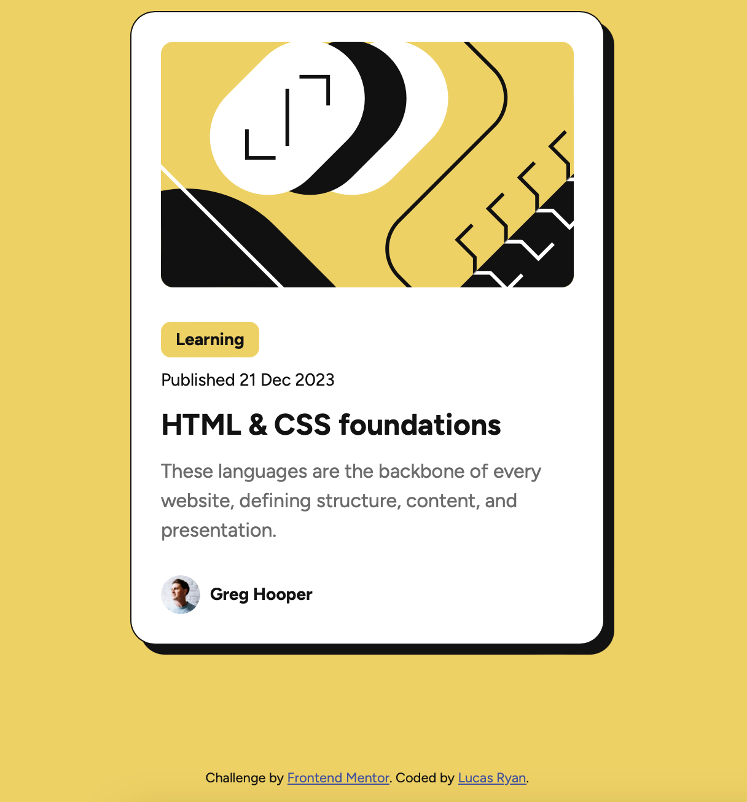

# Frontend Mentor - Blog preview card solution

This is a solution to the [Blog preview card challenge on Frontend Mentor](https://www.frontendmentor.io/challenges/blog-preview-card-ckPaj01IcS). Frontend Mentor challenges help you improve your coding skills by building realistic projects. 

## Table of contents

- [Overview](#overview)
  - [The challenge](#the-challenge)
  - [Screenshot](#screenshot)
  - [Links](#links)
- [My process](#my-process)
  - [Built with](#built-with)
  - [What I learned](#what-i-learned)
  - [Continued development](#continued-development)

## Overview

### The challenge

Users should be able to:

- See hover and focus states for all interactive elements on the page

### Screenshot



### Links

- Solution URL: https://luc0ryan.github.io/blog-preview-card-main/

## My process

### Built with

- Semantic HTML5 markup
- CSS custom properties
- Flexbox
- CSS Grid
- Mobile-first workflow
- Variables - colors

### What I learned
Pretty proud that I went a bit above and beyond and experimented with an external stylesheet to help clean up the workstation a bit visually. It made switching between CSS and HTML a little easier as well with dedicated pages for both. Next steps here is trying to do it all with tailwind.css to get best of both worlds.
```html
   <link rel="stylesheet" href="style.css" />
```

Also implemented variables here to make the build a little more design friendly. Felt a lot easier to use the actual names of colors versus constantly copying/pasting the color values, even if VScode does show a preview. It also leverages auto-complete to help you instantly slot in the correct color.

```css
:root {
 --yellow: hsl(47, 88%, 63%);
  --white: hsl(0, 0%, 100%);
  --gray500: hsl(0, 0%, 42%);
  --gray950: hsl(0, 0%, 7%);
  --blue: hsl(228, 45%, 44%);
}
```

### Continued development

Once again, I want to become more comfortable with industry tools like React and Tailwind, so as these projects get bigger I will challenge myself to utilize these tools to create a solid foundation for my own web development arsenal.
